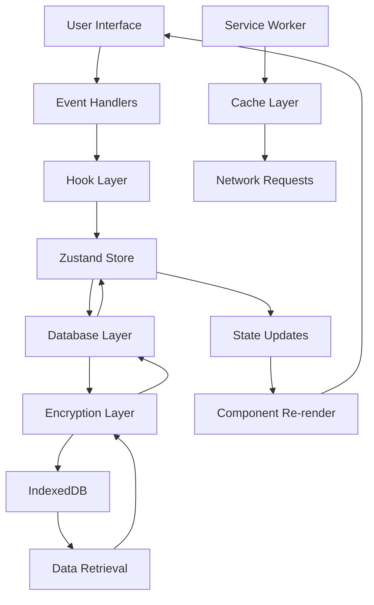
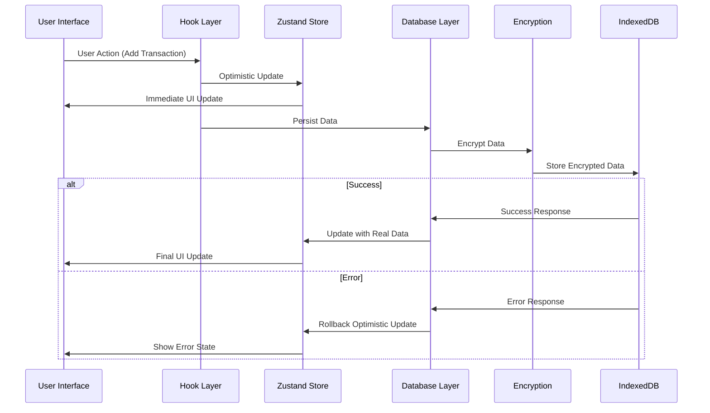
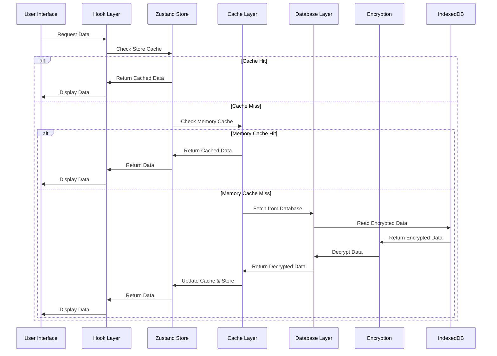
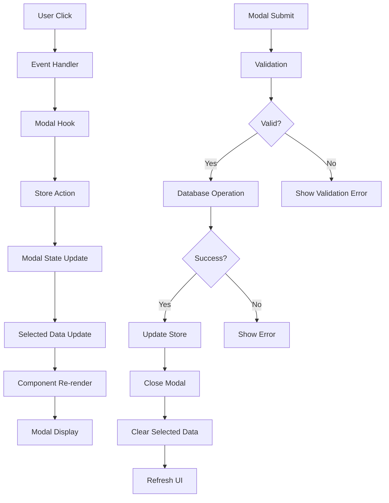
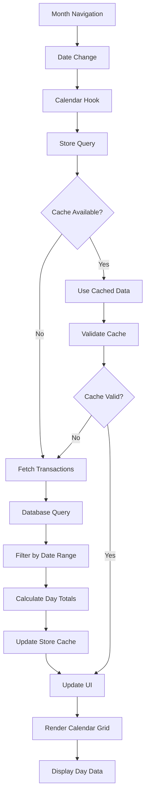
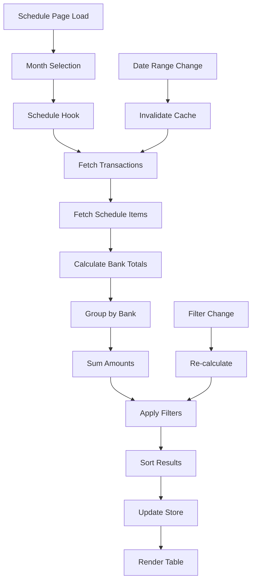
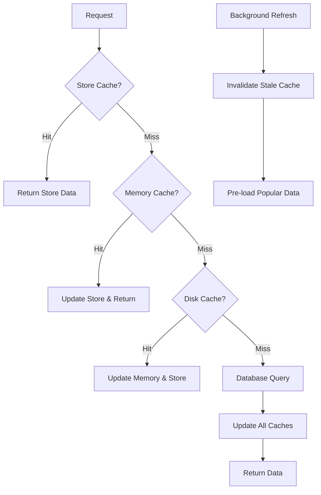
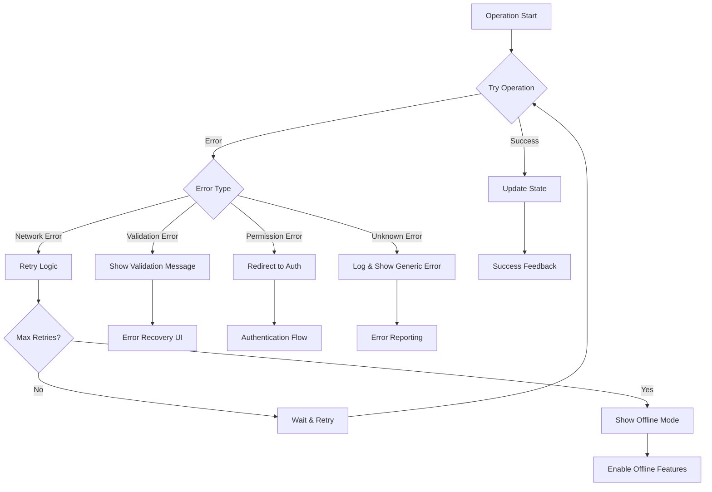
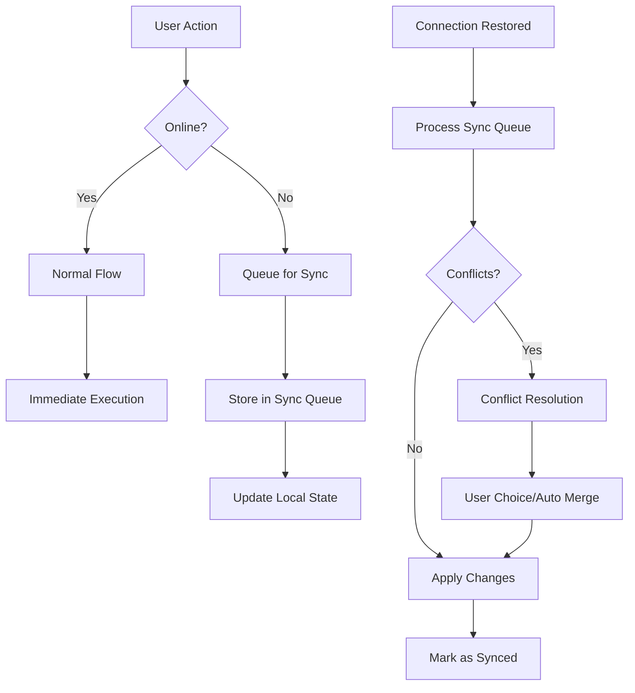

# データフロー アーキテクチャ

## 🔄 データフロー概要

銀行別引落予定表PWAにおけるデータフローは、ユーザーインタラクションから永続化まで、効率的で安全なデータ処理を実現しています。

### 基本原則

1. **単方向データフロー**: データは予測可能な方向にのみ流れる
2. **イミュータブル更新**: 状態の直接変更を避け、新しいオブジェクトを生成
3. **楽観的更新**: ユーザビリティを向上させる先行表示
4. **エラー境界**: 失敗時の適切なフォールバック
5. **キャッシュ戦略**: パフォーマンス向上のための効率的キャッシング

## 🌊 メインデータフロー

### 全体フロー図



### レイヤー詳細

| レイヤー | 責任 | 技術 |
|----------|------|------|
| UI Layer | ユーザーインタラクション | React Components |
| Hook Layer | ビジネスロジック | Custom Hooks |
| State Layer | 状態管理 | Zustand Store |
| Database Layer | データ操作 | Dexie.js |
| Encryption Layer | セキュリティ | Web Crypto API |
| Storage Layer | 永続化 | IndexedDB |

## 💾 データ永続化フロー

### 書き込みフロー（Create/Update）



### 読み込みフロー（Read）



## 🎭 モーダル データフロー

### モーダル開閉フロー



### クロスモーダル ナビゲーション

```typescript
// TransactionViewModal から TransactionModal への遷移
const handleEditTransaction = (transaction: Transaction) => {
  // 現在のモーダルを閉じる
  actions.closeModal('transactionView');
  
  // 編集モーダルを開く（データを引き継ぎ）
  actions.openModal('transaction', {
    transaction,
    date: new Date(transaction.date),
  });
};

// ScheduleModal から関連するTransactionModal への遷移
const handleScheduleTransactionClick = async (transactionId: string) => {
  try {
    // トランザクションをデータベースから取得
    const transaction = await database.getTransactionById(transactionId);
    
    if (transaction) {
      actions.closeModal('scheduleView');
      actions.openModal('transactionView', {
        transaction,
        date: new Date(transaction.date),
      });
    }
  } catch (error) {
    actions.setError('transactions', error as DatabaseError);
  }
};
```

## 📅 カレンダー データフロー

### 月次データ計算フロー



### 日別データ計算

```typescript
// カレンダー日別データの計算ロジック
export function useCalendarCalculations({
  transactions,
  schedule
}: UseCalendarCalculationsProps): UseCalendarCalculationsReturn {
  
  const dayTotals = useMemo(() => {
    const totals = new Map<string, DayTotalData>();
    
    // トランザクションデータの処理
    transactions.forEach(transaction => {
      const dateKey = formatDateISO(new Date(transaction.date));
      
      if (!totals.has(dateKey)) {
        totals.set(dateKey, createEmptyDayTotal(dateKey));
      }
      
      const dayTotal = totals.get(dateKey)!;
      
      // 金額の累積
      dayTotal.transactionTotal += transaction.amount;
      dayTotal.totalAmount += transaction.amount;
      dayTotal.transactionCount++;
      dayTotal.transactions.push(transaction);
      
      // 支払い方法別の分類
      if (transaction.paymentType === 'card') {
        dayTotal.cardTotal += transaction.amount;
      } else {
        dayTotal.directTotal += transaction.amount;
      }
      
      dayTotal.hasData = true;
      dayTotal.hasTransactions = true;
    });
    
    // スケジュールデータの処理
    if (schedule?.items) {
      schedule.items.forEach(item => {
        const dateKey = formatDateISO(new Date(item.scheduledDate));
        
        if (!totals.has(dateKey)) {
          totals.set(dateKey, createEmptyDayTotal(dateKey));
        }
        
        const dayTotal = totals.get(dateKey)!;
        dayTotal.scheduleTotal += item.amount;
        dayTotal.totalAmount += item.amount;
        dayTotal.scheduleItems.push(item);
        dayTotal.hasData = true;
        dayTotal.hasSchedule = true;
      });
    }
    
    return totals;
  }, [transactions, schedule]);
  
  return {
    dayTotals,
    getDayTotal: (date: Date) => dayTotals.get(formatDateISO(date)),
    hasDayData: (date: Date) => dayTotals.has(formatDateISO(date)),
    getMonthTotal: () => Array.from(dayTotals.values())
      .reduce((sum, day) => sum + day.totalAmount, 0),
  };
}
```

## 🏦 銀行別集計 データフロー

### 月次集計計算フロー



### 銀行別集計ロジック

```typescript
// 銀行別集計の計算
export const calculateBankTotals = (
  transactions: Transaction[],
  scheduleItems: ScheduleItem[],
  banks: Bank[]
): BankTotal[] => {
  const bankTotalsMap = new Map<string, BankTotal>();
  
  // 銀行マスターから初期化
  banks.forEach(bank => {
    bankTotalsMap.set(bank.id, {
      bankId: bank.id,
      bankName: bank.name,
      transactionTotal: 0,
      scheduleTotal: 0,
      totalAmount: 0,
      transactionCount: 0,
      scheduleCount: 0,
      lastPaymentDate: null,
    });
  });
  
  // トランザクションデータの集計
  transactions.forEach(transaction => {
    const bankId = transaction.bankId;
    if (bankId && bankTotalsMap.has(bankId)) {
      const bankTotal = bankTotalsMap.get(bankId)!;
      bankTotal.transactionTotal += transaction.amount;
      bankTotal.totalAmount += transaction.amount;
      bankTotal.transactionCount++;
      
      // 最後の支払い日を更新
      const paymentDate = new Date(transaction.scheduledPayDate || transaction.date);
      if (!bankTotal.lastPaymentDate || paymentDate > bankTotal.lastPaymentDate) {
        bankTotal.lastPaymentDate = paymentDate;
      }
    }
  });
  
  // スケジュールデータの集計
  scheduleItems.forEach(item => {
    const bankId = item.bankId;
    if (bankId && bankTotalsMap.has(bankId)) {
      const bankTotal = bankTotalsMap.get(bankId)!;
      bankTotal.scheduleTotal += item.amount;
      bankTotal.totalAmount += item.amount;
      bankTotal.scheduleCount++;
    }
  });
  
  return Array.from(bankTotalsMap.values())
    .filter(total => total.totalAmount > 0)
    .sort((a, b) => b.totalAmount - a.totalAmount);
};
```

## 🔄 キャッシュ戦略

### 多層キャッシュアーキテクチャ



### キャッシュ実装

```typescript
// キャッシュマネージャー
class CacheManager {
  private memoryCache = new Map<string, CacheEntry>();
  private readonly CACHE_SIZES = {
    MEMORY: 100, // 100エントリまで
    DISK: 1000,  // 1000エントリまで
  };
  
  // メモリキャッシュの取得
  getFromMemory<T>(key: string): T | null {
    const entry = this.memoryCache.get(key);
    
    if (!entry) return null;
    
    // 有効期限チェック
    if (Date.now() > entry.expiresAt) {
      this.memoryCache.delete(key);
      return null;
    }
    
    // アクセス時間更新（LRU用）
    entry.lastAccessed = Date.now();
    return entry.data as T;
  }
  
  // メモリキャッシュへの保存
  setInMemory<T>(key: string, data: T, ttl: number): void {
    // サイズ制限チェック
    if (this.memoryCache.size >= this.CACHE_SIZES.MEMORY) {
      this.evictLRU();
    }
    
    this.memoryCache.set(key, {
      data,
      createdAt: Date.now(),
      expiresAt: Date.now() + ttl,
      lastAccessed: Date.now(),
    });
  }
  
  // LRU エビクション
  private evictLRU(): void {
    let oldestKey = '';
    let oldestTime = Date.now();
    
    for (const [key, entry] of this.memoryCache.entries()) {
      if (entry.lastAccessed < oldestTime) {
        oldestTime = entry.lastAccessed;
        oldestKey = key;
      }
    }
    
    if (oldestKey) {
      this.memoryCache.delete(oldestKey);
    }
  }
  
  // バックグラウンド更新
  async backgroundRefresh(key: string, refreshFn: () => Promise<any>): Promise<void> {
    try {
      const freshData = await refreshFn();
      this.setInMemory(key, freshData, CACHE_DURATIONS.TRANSACTIONS);
    } catch (error) {
      console.warn(`Background refresh failed for ${key}:`, error);
    }
  }
}
```

## ⚡ パフォーマンス最適化

### 仮想化とページネーション

```typescript
// 大量データの効率的表示
export function useVirtualizedTransactions(
  transactions: Transaction[],
  containerHeight: number,
  itemHeight: number
) {
  const [scrollTop, setScrollTop] = useState(0);
  
  const visibleRange = useMemo(() => {
    const startIndex = Math.floor(scrollTop / itemHeight);
    const visibleCount = Math.ceil(containerHeight / itemHeight);
    const endIndex = Math.min(startIndex + visibleCount + 1, transactions.length);
    
    return {
      startIndex: Math.max(0, startIndex - 1),
      endIndex,
      visibleItems: transactions.slice(startIndex, endIndex),
    };
  }, [transactions, scrollTop, containerHeight, itemHeight]);
  
  return {
    ...visibleRange,
    onScroll: (event: React.UIEvent<HTMLDivElement>) => {
      setScrollTop(event.currentTarget.scrollTop);
    },
    totalHeight: transactions.length * itemHeight,
  };
}
```

### 楽観的更新パターン

```typescript
// 楽観的更新の実装
export const useOptimisticUpdate = <T extends { id: string }>(
  items: T[],
  addItem: (item: Omit<T, 'id'>) => Promise<T>,
  updateItem: (id: string, updates: Partial<T>) => Promise<T>,
  deleteItem: (id: string) => Promise<void>
) => {
  const [optimisticItems, setOptimisticItems] = useState(items);
  const [pendingOperations, setPendingOperations] = useState(new Set<string>());
  
  const optimisticAdd = async (item: Omit<T, 'id'>) => {
    const tempId = `temp-${Date.now()}`;
    const optimisticItem = { ...item, id: tempId } as T;
    
    // 即座にUIを更新
    setOptimisticItems(prev => [...prev, optimisticItem]);
    setPendingOperations(prev => new Set(prev).add(tempId));
    
    try {
      // バックエンドで実際の保存
      const savedItem = await addItem(item);
      
      // 成功時: 一時IDを実際のIDに置換
      setOptimisticItems(prev => 
        prev.map(i => i.id === tempId ? savedItem : i)
      );
    } catch (error) {
      // 失敗時: 楽観的更新をロールバック
      setOptimisticItems(prev => 
        prev.filter(i => i.id !== tempId)
      );
      throw error;
    } finally {
      setPendingOperations(prev => {
        const newSet = new Set(prev);
        newSet.delete(tempId);
        return newSet;
      });
    }
  };
  
  return {
    items: optimisticItems,
    isPending: (id: string) => pendingOperations.has(id),
    optimisticAdd,
    // optimisticUpdate, optimisticDelete も同様に実装
  };
};
```

## 🚨 エラーハンドリング フロー

### エラー境界とフォールバック



### エラー復旧戦略

```typescript
// エラー復旧フック
export const useErrorRecovery = () => {
  const { setError, clearError } = useAppStore(state => state.actions);
  
  const handleError = useCallback(async (
    error: Error,
    context: string,
    recoveryAction?: () => Promise<void>
  ) => {
    console.error(`Error in ${context}:`, error);
    
    // エラーの種類に応じた処理
    if (error instanceof NetworkError) {
      // ネットワークエラー: 再試行可能
      setError('network', {
        message: 'ネットワークエラーが発生しました。再試行してください。',
        recoverable: true,
        action: recoveryAction,
      });
    } else if (error instanceof ValidationError) {
      // バリデーションエラー: ユーザー修正が必要
      setError('validation', {
        message: error.message,
        recoverable: false,
        details: error.details,
      });
    } else {
      // 予期しないエラー: ログ送信
      setError('unknown', {
        message: '予期しないエラーが発生しました。',
        recoverable: false,
      });
      
      // エラーレポート送信（将来実装）
      // await sendErrorReport(error, context);
    }
  }, [setError]);
  
  const retry = useCallback(async (errorKey: string) => {
    const errorState = useAppStore.getState().errors[errorKey];
    
    if (errorState?.action) {
      try {
        await errorState.action();
        clearError(errorKey);
      } catch (retryError) {
        console.error('Retry failed:', retryError);
      }
    }
  }, [clearError]);
  
  return { handleError, retry };
};
```

## 📊 データ同期戦略

### オフライン対応フロー



### 同期キュー実装

```typescript
// オフライン同期マネージャー
class SyncManager {
  private syncQueue: SyncOperation[] = [];
  private isOnline = navigator.onLine;
  
  constructor() {
    // オンライン状態の監視
    window.addEventListener('online', this.processSyncQueue.bind(this));
    window.addEventListener('offline', this.handleOffline.bind(this));
  }
  
  // 操作をキューに追加
  queueOperation(operation: SyncOperation): void {
    this.syncQueue.push({
      ...operation,
      timestamp: Date.now(),
      attempts: 0,
    });
    
    // オンラインの場合は即座に実行を試行
    if (this.isOnline) {
      this.processSyncQueue();
    }
  }
  
  // 同期キューの処理
  private async processSyncQueue(): Promise<void> {
    if (!this.isOnline || this.syncQueue.length === 0) return;
    
    const operations = [...this.syncQueue];
    this.syncQueue = [];
    
    for (const operation of operations) {
      try {
        await this.executeOperation(operation);
      } catch (error) {
        operation.attempts++;
        
        // 最大試行回数に達していない場合は再キュー
        if (operation.attempts < MAX_RETRY_ATTEMPTS) {
          this.syncQueue.push(operation);
        } else {
          console.error('Sync operation failed permanently:', operation, error);
        }
      }
    }
  }
  
  // 個別操作の実行
  private async executeOperation(operation: SyncOperation): Promise<void> {
    switch (operation.type) {
      case 'CREATE_TRANSACTION':
        await database.addTransaction(operation.data);
        break;
      case 'UPDATE_TRANSACTION':
        await database.updateTransaction(operation.id, operation.data);
        break;
      case 'DELETE_TRANSACTION':
        await database.deleteTransaction(operation.id);
        break;
      default:
        throw new Error(`Unknown operation type: ${operation.type}`);
    }
  }
}
```

## 📈 監視とメトリクス

### パフォーマンス監視

```typescript
// パフォーマンス監視フック
export const usePerformanceMonitoring = () => {
  const measureOperation = useCallback((
    name: string,
    operation: () => Promise<any>
  ) => {
    return async () => {
      const startTime = performance.now();
      performance.mark(`${name}-start`);
      
      try {
        const result = await operation();
        
        const endTime = performance.now();
        const duration = endTime - startTime;
        
        performance.mark(`${name}-end`);
        performance.measure(name, `${name}-start`, `${name}-end`);
        
        // パフォーマンスログ
        if (duration > PERFORMANCE_THRESHOLDS[name]) {
          console.warn(`⚠️ Slow operation: ${name} took ${duration}ms`);
        }
        
        return result;
      } catch (error) {
        performance.mark(`${name}-error`);
        throw error;
      }
    };
  }, []);
  
  return { measureOperation };
};

// 使用例
const { measureOperation } = usePerformanceMonitoring();

const addTransactionWithMonitoring = measureOperation(
  'add-transaction',
  () => database.addTransaction(transactionData)
);
```

## 🔍 デバッグとトレーシング

### データフロー トレーシング

```typescript
// データフロー追跡デバッガー
class DataFlowTracer {
  private traces: TraceEvent[] = [];
  
  trace(event: string, data?: any, context?: string): void {
    if (process.env.NODE_ENV === 'development') {
      const traceEvent: TraceEvent = {
        timestamp: Date.now(),
        event,
        data: this.sanitizeData(data),
        context,
        stackTrace: new Error().stack,
      };
      
      this.traces.push(traceEvent);
      console.log(`🔍 [${context}] ${event}`, data);
      
      // 古いトレースを削除（メモリリーク防止）
      if (this.traces.length > 1000) {
        this.traces = this.traces.slice(-500);
      }
    }
  }
  
  getTraces(filter?: string): TraceEvent[] {
    if (!filter) return this.traces;
    return this.traces.filter(trace => 
      trace.event.includes(filter) || trace.context?.includes(filter)
    );
  }
  
  private sanitizeData(data: any): any {
    // 機密情報の除去
    if (typeof data === 'object' && data !== null) {
      const sanitized = { ...data };
      delete sanitized.password;
      delete sanitized.sessionKey;
      return sanitized;
    }
    return data;
  }
}

// グローバルトレーサー
export const dataFlowTracer = new DataFlowTracer();

// 使用例
dataFlowTracer.trace('TRANSACTION_ADDED', { id: transaction.id }, 'TransactionStore');
dataFlowTracer.trace('MODAL_OPENED', { type: 'transaction' }, 'ModalManager');
```

---

**関連ドキュメント**:
- [システム概要](./overview.md)
- [状態管理](./state-management.md)
- [パフォーマンス](./performance.md)
- [データベース API](../api/database.md)
