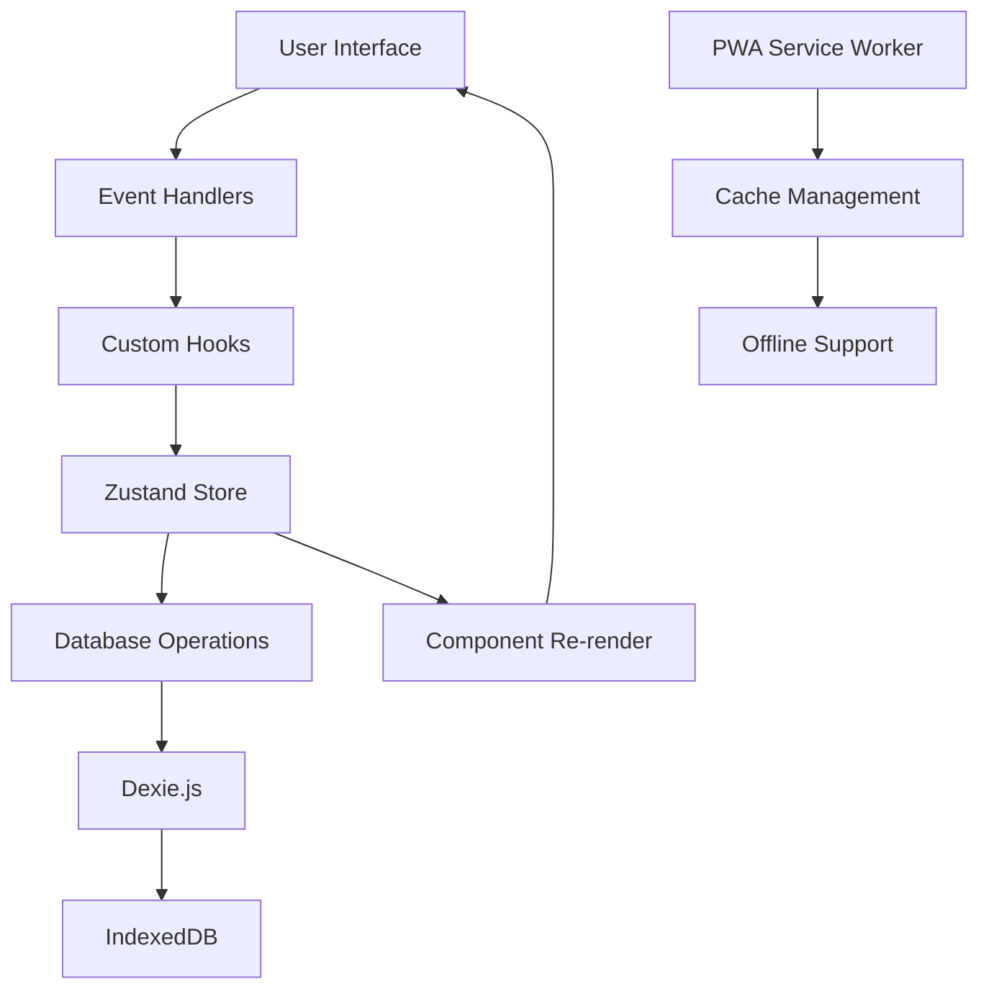
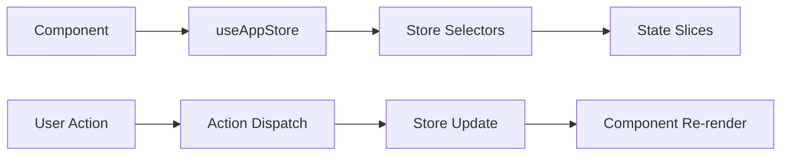
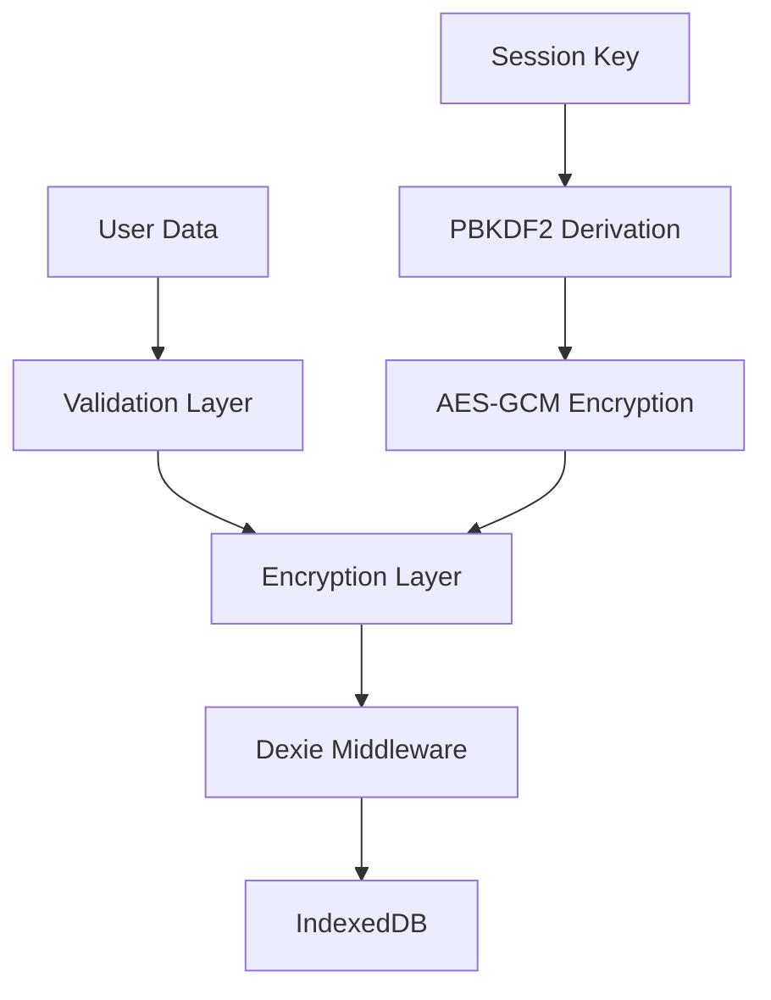
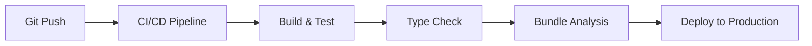

# システム概要

## 🏗️ アーキテクチャ概要

銀行別引落予定表PWAは、モダンなNext.js 13+を基盤とした、完全にクライアントサイドで動作するプログレッシブウェブアプリケーションです。

### 設計原則

1. **セキュリティファースト**: すべてのデータはクライアント暗号化
2. **オフライン対応**: 完全なオフライン機能
3. **パフォーマンス最適化**: 高速レスポンシブ UI
4. **型安全性**: TypeScript Strict Mode
5. **保守性**: モジュラー設計とテスト駆動開発

## 📱 システム構成

### アプリケーション層

```
┌─────────────────────────────────────────┐
│           Next.js App Router            │
├─────────────────────────────────────────┤
│    React 18 + TypeScript (Strict)      │
├─────────────────────────────────────────┤
│         Zustand State Management        │
├─────────────────────────────────────────┤
│       Custom Hooks Ecosystem           │
├─────────────────────────────────────────┤
│          Component Library              │
└─────────────────────────────────────────┘
```

### データ層

```
┌─────────────────────────────────────────┐
│          Dexie.js (IndexedDB)           │
├─────────────────────────────────────────┤
│       Web Crypto API Encryption        │
├─────────────────────────────────────────┤
│         PWA Cache Strategy              │
├─────────────────────────────────────────┤
│         Browser Storage APIs            │
└─────────────────────────────────────────┘
```

## 🔄 データフロー

### 全体的なデータフロー



### 状態管理フロー



## 🗂️ ディレクトリ構造

### プロジェクト構成

```
src/
├── app/                    # Next.js App Router
│   ├── layout.tsx         # Root Layout
│   ├── page.tsx           # Home Page (Calendar)
│   ├── schedule/          # Schedule Page
│   └── settings/          # Settings Page
├── components/            # React Components
│   ├── calendar/         # Calendar Components
│   ├── encryption/       # Encryption UI
│   ├── schedule/         # Schedule Management
│   ├── settings/         # Settings UI
│   └── ui/              # Reusable UI Components
├── hooks/                # Custom React Hooks
│   └── modal/           # Modal Management
├── lib/                  # Core Libraries
│   ├── database/        # Database Operations
│   ├── hooks/           # Utility Hooks
│   └── utils/           # Utility Functions
├── store/               # Zustand State Management
│   ├── slices/          # Store Slices
│   ├── selectors/       # State Selectors
│   └── types/           # Store Types
└── types/               # TypeScript Types
```

### コンポーネント階層

```
App Layout
├── Navigation
├── Encryption Provider
│   ├── Session Lock
│   └── Auto Lock Warning
└── Page Content
    ├── Calendar View
    │   ├── Month Navigation
    │   ├── Calendar Grid
    │   │   └── Calendar Cells
    │   └── Modals
    │       ├── Transaction Modal
    │       ├── Schedule Modal
    │       └── Day Total Modal
    ├── Schedule Page
    │   ├── Month Selector
    │   ├── Schedule Filters
    │   └── Bank Schedule Table
    └── Settings Page
        ├── Bank Master
        └── Card Master
```

## 🔧 核心技術スタック

### フロントエンド技術

| 技術 | バージョン | 用途 | 特徴 |
|------|----------|------|------|
| Next.js | 15+ | フレームワーク | App Router, SSG, PWA |
| React | 18+ | UI ライブラリ | Concurrent Features, Hooks |
| TypeScript | 5.3+ | 型システム | Strict Mode, 型安全性 |
| Tailwind CSS | 3.4+ | スタイリング | ユーティリティファースト |
| Zustand | 5.0+ | 状態管理 | 軽量, TypeScript対応 |

### データ・セキュリティ技術

| 技術 | 用途 | 実装詳細 |
|------|------|----------|
| Dexie.js | IndexedDB ORM | トランザクション, スキーマ管理 |
| Web Crypto API | 暗号化 | AES-GCM, PBKDF2 |
| dexie-encrypted | データ暗号化 | 透明な暗号化ミドルウェア |
| Service Worker | PWA機能 | オフライン, キャッシュ戦略 |

### 開発・テスト技術

| 技術 | 用途 | 設定 |
|------|------|------|
| Jest | ユニットテスト | jsdom環境, カバレッジ |
| React Testing Library | コンポーネントテスト | ユーザー中心テスト |
| Playwright | E2Eテスト | ブラウザ自動化 |
| ESLint | 静的解析 | TypeScript対応 |
| Prettier | コードフォーマット | 統一スタイル |

## 🏛️ アーキテクチャパターン

### 1. Component-Hook-Store パターン

```typescript
// Component Layer
function CalendarView() {
  const { dayTotals, getDayTotal } = useCalendarCalculations({
    transactions,
    schedule
  });
  
  return <CalendarGrid onDateClick={handleDateClick} />;
}

// Hook Layer
function useCalendarCalculations({ transactions, schedule }) {
  return useMemo(() => {
    // Complex calculation logic
  }, [transactions, schedule]);
}

// Store Layer
const useAppStore = create<AppStore>((set, get) => ({
  transactions: [],
  actions: {
    addTransaction: (transaction) => set(state => ({
      transactions: [...state.transactions, transaction]
    }))
  }
}));
```

### 2. Modal Management パターン

```typescript
// Centralized Modal State
interface ModalStates {
  transaction: boolean;
  scheduleView: boolean;
  dayTotal: boolean;
}

// Modal Actions
interface ModalActions {
  openModal: (type: ModalType, data?: SelectedData) => void;
  closeModal: (type: ModalType) => void;
  closeAllModals: () => void;
}

// Usage
const { openModal } = useModalStore();
openModal('transaction', { date: selectedDate });
```

### 3. Database Abstraction パターン

```typescript
// Database Operations Layer
class DatabaseOperations {
  async addTransaction(transaction: TransactionInput): Promise<void> {
    await this.db.transactions.add(transaction);
  }
  
  async getTransactionsByDateRange(start: Date, end: Date): Promise<Transaction[]> {
    return await this.db.transactions
      .where('date')
      .between(start.getTime(), end.getTime())
      .toArray();
  }
}

// Hook Layer
function useDatabase() {
  const operations = useMemo(() => new DatabaseOperations(), []);
  return operations;
}
```

## 🔒 セキュリティアーキテクチャ

### 暗号化層



### セキュリティ要件

1. **データ暗号化**: すべてのデータをAES-GCM 256bitで暗号化
2. **キー管理**: PBKDF2による安全なキー導出
3. **セッション管理**: 自動タイムアウトとロック機能
4. **入力検証**: Zodスキーマによる厳密な検証
5. **CSP**: Content Security Policyでスクリプト実行制御

## ⚡ パフォーマンス設計

### 最適化戦略

1. **レンダリング最適化**
   - React.memo によるコンポーネントメモ化
   - useMemo/useCallback による計算結果キャッシュ
   - Zustand選択的購読による不要な再描画防止

2. **データ最適化**
   - 仮想化によるリスト表示最適化
   - インデックス最適化によるクエリ高速化
   - Service Workerによるリソースキャッシュ

3. **バンドル最適化**
   - Tree Shakingによる未使用コード除去
   - Code Splittingによる動的インポート
   - 最適化されたプロダクションビルド

### パフォーマンス目標

| 指標 | 目標値 | 測定方法 |
|------|--------|----------|
| 初期表示 | < 3秒 | Lighthouse |
| 取引追加 | < 100ms | Performance API |
| カレンダー描画 | < 50ms | React DevTools |
| メモリ使用量 | < 50MB | Chrome DevTools |

## 🔧 開発環境

### 必要なツール

- **Node.js**: 18.0.0以上
- **npm**: 9.0.0以上
- **ブラウザ**: Chrome 100+, Safari 15+, Firefox 100+

### 開発コマンド

```bash
# 開発サーバー起動
npm run dev

# プロダクションビルド
npm run build

# テスト実行
npm test

# 型チェック
npm run type-check

# Lint実行
npm run lint
```

## 🧪 テスト戦略

### テスト構成

```
__tests__/
├── components/          # コンポーネントテスト
├── hooks/              # フックテスト
├── store/              # ストアテスト
├── integration/        # 統合テスト
├── performance/        # パフォーマンステスト
└── e2e/               # E2Eテスト
```

### テストカバレッジ目標

- **全体**: 90%以上
- **コアロジック**: 95%以上
- **状態管理**: 95%以上
- **コンポーネント**: 80%以上

## 🚀 デプロイ戦略

### ビルド・デプロイフロー



### 環境構成

- **開発環境**: Next.js dev server
- **ステージング**: Vercel Preview
- **プロダクション**: Vercel Production または 静的ホスティング

## 📊 監視・メトリクス

### 監視項目

1. **パフォーマンス**: Core Web Vitals
2. **エラー**: JavaScript例外, API失敗
3. **使用状況**: ページビュー, 機能利用率
4. **セキュリティ**: 異常なアクセスパターン

## 🔄 今後の拡張計画

### Phase 4 計画

- [ ] マルチデバイス同期
- [ ] CSVインポート/エクスポート
- [ ] プッシュ通知
- [ ] ダークモード対応
- [ ] 多言語対応

### 技術的課題

1. **スケーラビリティ**: 大量データ処理最適化
2. **セキュリティ**: 新しい脅威への対応
3. **パフォーマンス**: さらなる高速化
4. **ユーザビリティ**: アクセシビリティ向上

---

**関連ドキュメント**:
- [データフロー](./data-flow.md)
- [状態管理](./state-management.md)
- [パフォーマンス](./performance.md)
