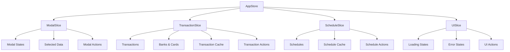

# 状態管理アーキテクチャ

## 🏪 Zustand ベース状態管理

本アプリケーションはZustandを中心とした効率的な状態管理アーキテクチャを採用しています。

### 設計原則

1. **単一責任の原則**: 各スライスは特定の領域のみを担当
2. **イミュータブル更新**: 状態の直接変更を避け、新しいオブジェクトを生成
3. **型安全性**: TypeScriptによる厳密な型チェック
4. **パフォーマンス最適化**: 選択的購読による不要な再描画防止
5. **テスタビリティ**: 単体テスト可能な設計

## 🗂️ ストア構成

### 全体アーキテクチャ

```typescript
interface AppStore extends 
  ModalSlice, 
  TransactionSlice, 
  ScheduleSlice, 
  UISlice {}
```

### スライス構成図



## 🎯 Modal Slice

### 状態構造

```typescript
interface ModalSlice {
  modalStates: ModalStates;
  selectedData: SelectedData;
  actions: ModalActions;
}

interface ModalStates {
  transaction: boolean;
  transactionView: boolean;
  scheduleView: boolean;
  scheduleEdit: boolean;
  dayTotal: boolean;
}

interface SelectedData {
  date: Date | null;
  transaction: Transaction | null;
  transactions: Transaction[];
  scheduleItems: ScheduleItem[];
  scheduleItem: ScheduleItem | null;
  dayTotalData: DayTotalData | null;
}
```

### アクション例

```typescript
interface ModalActions {
  openModal: (modalType: ModalType, data?: Partial<SelectedData>) => void;
  closeModal: (modalType: ModalType) => void;
  closeAllModals: () => void;
  setSelectedData: (data: Partial<SelectedData>) => void;
  clearSelectedData: () => void;
  
  // クロスモーダル操作
  handleTransactionViewTransactionClick: (transaction: Transaction) => void;
  handleScheduleTransactionClick: (transactionId: string) => Promise<void>;
}
```

### 実装例

```typescript
export const createModalSlice: StateCreator<AppStore, [], [], ModalSlice> = 
(set, get) => ({
  modalStates: initialModalStates,
  selectedData: initialSelectedData,
  
  actions: {
    openModal: (modalType: ModalType, data?: Partial<SelectedData>) => {
      set((state) => ({
        modalStates: {
          ...state.modalStates,
          [modalType]: true,
        },
        selectedData: data ? {
          ...state.selectedData,
          ...data,
        } : state.selectedData,
      }));
    },
    
    closeModal: (modalType: ModalType) => {
      set((state) => ({
        modalStates: {
          ...state.modalStates,
          [modalType]: false,
        },
      }));
    },
    
    // クロスモーダル操作の実装
    handleTransactionViewTransactionClick: (transaction: Transaction) => {
      const { closeModal, openModal } = get().actions;
      closeModal('transactionView');
      openModal('transaction', { 
        transaction,
        date: new Date(transaction.date)
      });
    },
  }
});
```

## 💳 Transaction Slice

### 状態構造

```typescript
interface TransactionSlice {
  transactions: Transaction[];
  transactionCache: TransactionCache;
  banks: Bank[];
  cards: Card[];
  actions: TransactionActions;
}

interface TransactionCache {
  [key: string]: {
    data: Transaction[];
    timestamp: number;
    expiresAt: number;
  };
}
```

### キャッシュ戦略

```typescript
// キャッシュキー生成
const createCacheKey = (filters?: TransactionFilters): string => {
  if (!filters) return 'all';
  const { dateRange, paymentType, cardId } = filters;
  return `${dateRange?.start}-${dateRange?.end}-${paymentType}-${cardId}`;
};

// キャッシュ有効性確認
const isCacheValid = (cacheEntry: CacheEntry): boolean => {
  return Date.now() < cacheEntry.expiresAt;
};

// トランザクション取得（キャッシュ対応）
fetchTransactions: async (filters?: TransactionFilters) => {
  const cacheKey = createCacheKey(filters);
  const cached = get().transactionCache[cacheKey];
  
  if (cached && isCacheValid(cached)) {
    return cached.data;
  }
  
  const { setLoading, setError } = get().actions;
  
  try {
    setLoading('transactions', true);
    const data = await database.getTransactions(filters);
    
    // キャッシュ更新
    set((state) => ({
      transactionCache: {
        ...state.transactionCache,
        [cacheKey]: {
          data,
          timestamp: Date.now(),
          expiresAt: Date.now() + CACHE_DURATIONS.TRANSACTIONS,
        },
      },
      transactions: data,
    }));
    
    return data;
  } catch (error) {
    setError('transactions', error as DatabaseError);
    throw error;
  } finally {
    setLoading('transactions', false);
  }
}
```

### 楽観的更新

```typescript
// 楽観的更新パターン
createTransaction: async (input: TransactionInput) => {
  const tempId = `temp-${Date.now()}`;
  const optimisticTransaction: Transaction = {
    ...input,
    id: tempId,
    createdAt: Date.now(),
    updatedAt: Date.now(),
  };
  
  // 楽観的更新
  set((state) => ({
    transactions: [...state.transactions, optimisticTransaction],
  }));
  
  try {
    const savedTransaction = await database.addTransaction(input);
    
    // 成功時の状態更新
    set((state) => ({
      transactions: state.transactions.map(t => 
        t.id === tempId ? savedTransaction : t
      ),
    }));
    
    // キャッシュ無効化
    get().actions.invalidateTransactionCache();
    
  } catch (error) {
    // 失敗時のロールバック
    set((state) => ({
      transactions: state.transactions.filter(t => t.id !== tempId),
    }));
    
    get().actions.setError('saving', error as DatabaseError);
    throw error;
  }
}
```

## 📅 Schedule Slice

### 状態構造

```typescript
interface ScheduleSlice {
  schedules: { [key: string]: MonthlySchedule };
  scheduleCache: ScheduleCache;
  actions: ScheduleActions;
}

interface MonthlySchedule {
  year: number;
  month: number;
  items: ScheduleItem[];
  totalAmount: number;
  bankTotals: { [bankId: string]: number };
}
```

### 月次スケジュール管理

```typescript
// 月次スケジュール取得
fetchMonthlySchedule: async (year: number, month: number) => {
  const scheduleKey = `${year}-${month}`;
  const cached = get().scheduleCache[scheduleKey];
  
  if (cached && isCacheValid(cached)) {
    return cached.data;
  }
  
  try {
    set((state) => ({
      loading: { ...state.loading, schedules: true }
    }));
    
    const schedule = await calculateMonthlySchedule(year, month);
    
    set((state) => ({
      schedules: {
        ...state.schedules,
        [scheduleKey]: schedule,
      },
      scheduleCache: {
        ...state.scheduleCache,
        [scheduleKey]: {
          data: schedule,
          timestamp: Date.now(),
          expiresAt: Date.now() + CACHE_DURATIONS.SCHEDULES,
        },
      },
    }));
    
    return schedule;
  } catch (error) {
    set((state) => ({
      errors: { ...state.errors, schedules: error as DatabaseError }
    }));
    throw error;
  } finally {
    set((state) => ({
      loading: { ...state.loading, schedules: false }
    }));
  }
}
```

## 🎨 UI Slice

### 状態構造

```typescript
interface UISlice {
  loading: LoadingStates;
  errors: ErrorStates;
  actions: UIActions;
}

interface LoadingStates {
  transactions: boolean;
  schedules: boolean;
  banks: boolean;
  cards: boolean;
  saving: boolean;
  deleting: boolean;
}

interface ErrorStates {
  transactions: DatabaseError | null;
  schedules: DatabaseError | null;
  banks: DatabaseError | null;
  cards: DatabaseError | null;
  saving: DatabaseError | null;
  deleting: DatabaseError | null;
}
```

### エラーハンドリング

```typescript
interface UIActions {
  setLoading: (key: keyof LoadingStates, loading: boolean) => void;
  setError: (key: keyof ErrorStates, error: DatabaseError | null) => void;
  clearErrors: () => void;
  clearError: (key: keyof ErrorStates) => void;
}

// エラー設定
setError: (key: keyof ErrorStates, error: DatabaseError | null) => {
  set((state) => ({
    errors: {
      ...state.errors,
      [key]: error,
    },
  }));
  
  // エラーログ記録
  if (error) {
    console.error(`Error in ${key}:`, error);
  }
},

// 自動エラークリア（5秒後）
const autoErrorClear = (key: keyof ErrorStates) => {
  setTimeout(() => {
    get().actions.clearError(key);
  }, 5000);
};
```

## 🎣 ストアフック

### 基本使用パターン

```typescript
// 全ストアアクセス
const { modalStates, transactions, actions } = useAppStore();

// 選択的購読（パフォーマンス最適化）
const modalStates = useAppStore(state => state.modalStates);
const transactions = useAppStore(state => state.transactions);

// アクションのみ
const actions = useAppStore(state => state.actions);
```

### 便利フック

```typescript
// モーダル状態専用フック
export const useModalState = (modalType?: ModalType) => {
  return useAppStore((state) => {
    if (modalType) {
      return state.modalStates[modalType];
    }
    return state.modalStates;
  });
};

// 選択データ専用フック
export const useSelectedData = () => {
  return useAppStore((state) => state.selectedData);
};

// ローディング状態チェック
export const useIsLoading = (key?: keyof LoadingStates) => {
  return useAppStore((state) => {
    if (key) {
      return state.loading[key];
    }
    return Object.values(state.loading).some(Boolean);
  });
};

// エラー状態チェック
export const useHasError = (key?: keyof ErrorStates) => {
  return useAppStore((state) => {
    if (key) {
      return state.errors[key] !== null;
    }
    return Object.values(state.errors).some(Boolean);
  });
};
```

## 🔄 セレクタパターン

### 基本セレクタ

```typescript
// 計算済みセレクタ
export const selectors = {
  // トランザクション関連
  getTransactionById: (id: string) => (state: AppStore) =>
    state.transactions.find(t => t.id === id),
  
  getTransactionsByDateRange: (start: number, end: number) => (state: AppStore) =>
    state.transactions.filter(t => 
      t.date >= start && t.date <= end
    ),
  
  // モーダル関連
  isAnyModalOpen: (state: AppStore) =>
    Object.values(state.modalStates).some(Boolean),
  
  getOpenModals: (state: AppStore) =>
    Object.entries(state.modalStates)
      .filter(([_, isOpen]) => isOpen)
      .map(([modalType, _]) => modalType as ModalType),
  
  // UI状態関連
  isAnythingLoading: (state: AppStore) =>
    Object.values(state.loading).some(Boolean),
  
  hasAnyError: (state: AppStore) =>
    Object.values(state.errors).some(Boolean),
};

// 派生セレクタ
export const derivedSelectors = {
  getCurrentMonthTransactions: (year: number, month: number) => (state: AppStore) => {
    const startOfMonth = new Date(year, month - 1, 1).getTime();
    const endOfMonth = new Date(year, month, 0).getTime();
    return selectors.getTransactionsByDateRange(startOfMonth, endOfMonth)(state);
  },
  
  getTransactionsByPaymentType: (paymentType: string) => (state: AppStore) =>
    state.transactions.filter(t => t.paymentType === paymentType),
  
  getBankTransactionTotals: (state: AppStore) => {
    const totals: { [bankId: string]: number } = {};
    state.transactions.forEach(t => {
      if (t.bankId) {
        totals[t.bankId] = (totals[t.bankId] || 0) + t.amount;
      }
    });
    return totals;
  },
};
```

### セレクタの使用例

```typescript
// コンポーネント内での使用
function TransactionList({ dateRange }: { dateRange: { start: number; end: number } }) {
  const transactions = useAppStore(
    selectors.getTransactionsByDateRange(dateRange.start, dateRange.end)
  );
  
  const isLoading = useIsLoading('transactions');
  const error = useAppStore(state => state.errors.transactions);
  
  if (isLoading) return <Loading />;
  if (error) return <Error error={error} />;
  
  return (
    <div>
      {transactions.map(transaction => (
        <TransactionItem key={transaction.id} transaction={transaction} />
      ))}
    </div>
  );
}
```

## ⚡ パフォーマンス最適化

### 1. 選択的購読

```typescript
// ❌ 悪い例: 全体ストアを購読
const store = useAppStore();
const transactions = store.transactions; // 他の状態変更でも再描画

// ✅ 良い例: 必要な部分のみ購読
const transactions = useAppStore(state => state.transactions);
```

### 2. メモ化セレクタ

```typescript
// 重い計算をメモ化
const getMemoizedTransactionTotals = useMemo(() => 
  createSelector(
    (state: AppStore) => state.transactions,
    (transactions) => {
      // 重い計算
      return transactions.reduce((totals, t) => {
        totals[t.paymentType] = (totals[t.paymentType] || 0) + t.amount;
        return totals;
      }, {} as Record<string, number>);
    }
  ), []
);
```

### 3. バッチ更新

```typescript
// 複数の状態を一度に更新
const handleBulkOperation = async (operations: Operation[]) => {
  set((state) => {
    // すべての更新を一度に実行
    const newState = { ...state };
    operations.forEach(op => {
      applyOperation(newState, op);
    });
    return newState;
  });
};
```

## 🧪 テスト戦略

### ストアのテスト

```typescript
describe('Modal Slice', () => {
  let store: AppStore;
  
  beforeEach(() => {
    store = createAppStore().getState();
  });
  
  it('should open modal with correct data', () => {
    const mockDate = new Date('2024-02-15');
    const mockTransaction = createMockTransaction();
    
    act(() => {
      store.actions.openModal('transaction', { 
        date: mockDate, 
        transaction: mockTransaction 
      });
    });
    
    expect(store.modalStates.transaction).toBe(true);
    expect(store.selectedData.transaction).toEqual(mockTransaction);
    expect(store.selectedData.date).toEqual(mockDate);
  });
  
  it('should handle cross-modal transitions', () => {
    const transaction = createMockTransaction();
    
    // 最初にtransactionViewを開く
    act(() => {
      store.actions.openModal('transactionView', { transaction });
    });
    
    // transactionViewからtransactionModalへ遷移
    act(() => {
      store.actions.handleTransactionViewTransactionClick(transaction);
    });
    
    expect(store.modalStates.transactionView).toBe(false);
    expect(store.modalStates.transaction).toBe(true);
    expect(store.selectedData.transaction).toEqual(transaction);
  });
});
```

### フックのテスト

```typescript
describe('useModalState', () => {
  it('should return specific modal state', () => {
    const { result } = renderHook(() => useModalState('transaction'));
    
    act(() => {
      useAppStore.getState().actions.openModal('transaction');
    });
    
    expect(result.current).toBe(true);
  });
  
  it('should return all modal states when no type specified', () => {
    const { result } = renderHook(() => useModalState());
    
    act(() => {
      useAppStore.getState().actions.openModal('transaction');
    });
    
    expect(result.current.transaction).toBe(true);
    expect(result.current.scheduleView).toBe(false);
  });
});
```

## 🔧 デバッグとトラブルシューティング

### Redux DevTools 統合

```typescript
const useAppStore = create<AppStore>()(
  devtools(
    (...args) => ({
      ...createModalSlice(...args),
      ...createTransactionSlice(...args),
      ...createScheduleSlice(...args),
      ...createUISlice(...args),
    }),
    {
      name: 'bank-payment-schedule-store',
      enabled: process.env.NODE_ENV === 'development',
    }
  )
);
```

### ログとデバッグ

```typescript
// アクション実行時のログ
const logAction = (actionName: string, payload?: any) => {
  if (process.env.NODE_ENV === 'development') {
    console.group(`🏪 Store Action: ${actionName}`);
    console.log('Payload:', payload);
    console.log('Current State:', useAppStore.getState());
    console.groupEnd();
  }
};

// ストア状態の監視
const subscribeToStoreChanges = () => {
  useAppStore.subscribe((state, prevState) => {
    if (process.env.NODE_ENV === 'development') {
      console.log('Store State Changed:', {
        before: prevState,
        after: state,
      });
    }
  });
};
```

### パフォーマンス監視

```typescript
// 重い操作のパフォーマンス測定
const measureStorePerformance = (actionName: string, action: () => void) => {
  const startTime = performance.now();
  action();
  const endTime = performance.now();
  
  console.log(`⚡ ${actionName} took ${endTime - startTime} milliseconds`);
};

// 使用例
measureStorePerformance('Bulk Transaction Addition', () => {
  store.actions.addMultipleTransactions(largeTransactionList);
});
```

## 📚 ベストプラクティス

### 1. ストア設計

- **小さく、集中したスライス**を作成する
- **イミュータブル更新**を必ず使用する
- **計算済みの値はセレクタ**で提供する
- **サイドエフェクト（API呼び出し）**はアクション内で管理する

### 2. パフォーマンス

- **選択的購読**を活用する
- **メモ化**を適切に使用する
- **バッチ更新**で複数の状態変更をまとめる
- **不要な再描画**を避ける

### 3. テスト

- **ストアロジックを単体テスト**する
- **統合テスト**でフローをテストする
- **エラーケース**も必ずテストする
- **パフォーマンステスト**で重要な操作をベンチマークする

### 4. デバッグ

- **Redux DevTools**を活用する
- **詳細なログ**を開発環境で出力する
- **パフォーマンス測定**を重要な操作で実施する

---

**関連ドキュメント**:
- [システム概要](./overview.md)
- [データフロー](./data-flow.md)
- [パフォーマンス](./performance.md)
- [フック詳細](../hooks/)
