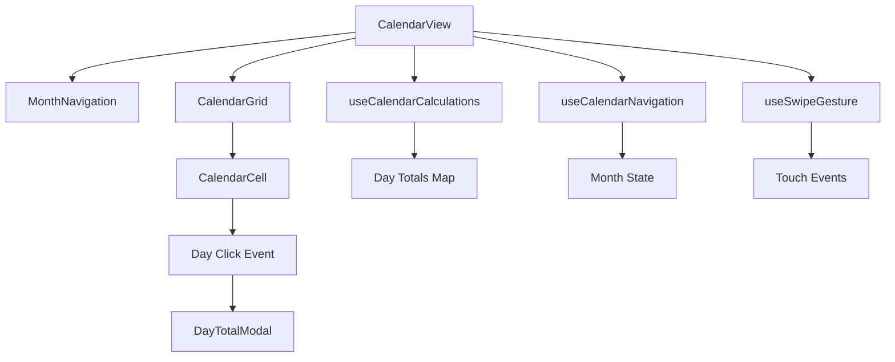
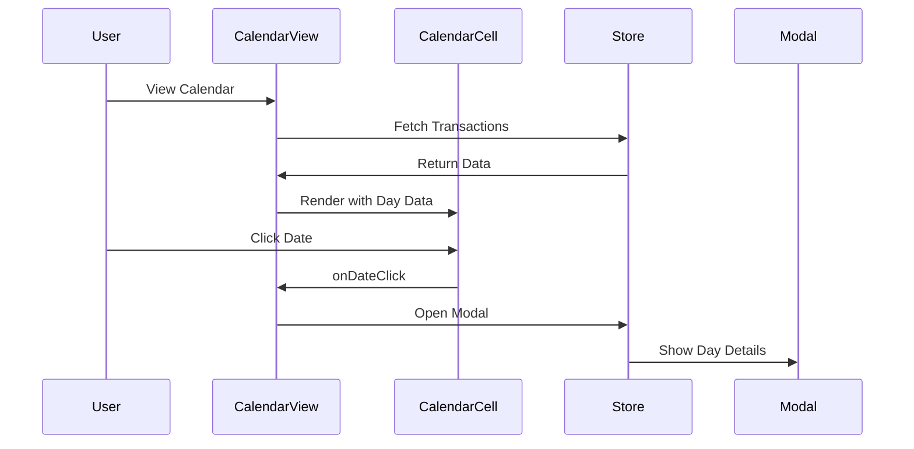

# カレンダーコンポーネント

## 📅 概要

カレンダーコンポーネントは、取引データと引落予定を視覚的に表示し、ユーザーが日付ベースでデータを管理できるUIを提供します。

### 主要コンポーネント

| コンポーネント | 説明 | 責任 |
|----------------|------|------|
| `CalendarView` | メインカレンダー表示 | 月次表示、日別データ集計 |
| `CalendarCell` | 個別日付セル | 日付表示、イベント処理 |
| `MonthNavigation` | 月次ナビゲーション | 前後月移動、現在月表示 |
| `DayTotalModal` | 日別合計モーダル | 日別詳細情報表示 |

## 🏗️ アーキテクチャ

### コンポーネント関係図



### データフロー



## 📦 エクスポート

```typescript
// src/components/calendar/index.ts
export { CalendarView, type CalendarViewProps } from './CalendarView';
export { MonthNavigation, type MonthNavigationProps } from './MonthNavigation';
export { CalendarCell, type CalendarCellProps } from './CalendarCell';
export { DayTotalModal, type DayTotalModalProps } from './DayTotalModal';

// Modal components
export { TransactionModal, type TransactionModalProps } from './TransactionModal';
export { TransactionViewModal, type TransactionViewModalProps } from './TransactionViewModal';
export { ScheduleModal, type ScheduleModalProps } from './ScheduleModal';
export { ScheduleViewModal, type ScheduleViewModalProps } from './ScheduleViewModal';
export { ScheduleEditModal, type ScheduleEditModalProps } from './ScheduleEditModal';
export { BaseModal, BaseModalFooter, type BaseModalProps, type BaseModalFooterProps } from './BaseModal';
```

## 🎨 スタイルガイド

### デザインシステム

```scss
// カレンダー固有のスタイル
.calendar-grid {
  display: grid;
  grid-template-columns: repeat(7, 1fr);
  gap: 1px;
  background-color: #e9edf5;
  border-radius: 8px;
  overflow: hidden;
}

.calendar-cell {
  background: white;
  min-height: 80px;
  padding: 8px;
  cursor: pointer;
  transition: background-color 0.2s ease;
  
  &:hover {
    background-color: #f6f7fb;
  }
  
  &.today {
    background-color: #e6f3ff;
    border: 2px solid #1f6feb;
  }
  
  &.has-data {
    font-weight: 600;
  }
  
  &.weekend {
    background-color: #f8f9fa;
  }
}

.day-total {
  font-size: 0.75rem;
  color: #666666;
  margin-top: 4px;
  
  &.positive {
    color: #059669;
  }
  
  &.negative {
    color: #dc2626;
  }
}
```

### カラーパレット

| 用途 | カラー | 説明 |
|------|--------|------|
| 今日 | `#1f6feb` | 今日の日付ハイライト |
| データあり | `#059669` | プラス金額 |
| 支出 | `#dc2626` | マイナス金額 |
| 背景 | `#ffffff` | セル背景 |
| ホバー | `#f6f7fb` | ホバー状態 |
| 週末 | `#f8f9fa` | 土日背景 |

## 🔄 状態管理統合

### Zustand Store との連携

```typescript
// カレンダーコンポーネントでのストア使用例
function CalendarView() {
  // 必要なデータのみを選択的に購読
  const transactions = useAppStore(state => state.transactions);
  const { openModal } = useModalStore();
  
  // カレンダー計算フック
  const { dayTotals, getDayTotal } = useCalendarCalculations({
    transactions,
    schedule: monthlySchedule,
  });
  
  const handleDateClick = useCallback((date: Date) => {
    const dayData = getDayTotal(date);
    if (dayData) {
      openModal('dayTotal', { 
        date, 
        dayTotalData: dayData 
      });
    } else {
      openModal('transaction', { date });
    }
  }, [getDayTotal, openModal]);
  
  return (
    <div className="calendar-container">
      {/* カレンダー実装 */}
    </div>
  );
}
```

## 📚 関連ドキュメント

- [CalendarView 詳細](./CalendarView.md)
- [CalendarCell 詳細](./CalendarCell.md)
- [MonthNavigation 詳細](./MonthNavigation.md)
- [DayTotalModal 詳細](./DayTotalModal.md)
- [カレンダーフック](../../hooks/calendar.md)
- [状態管理](../../architecture/state-management.md)
