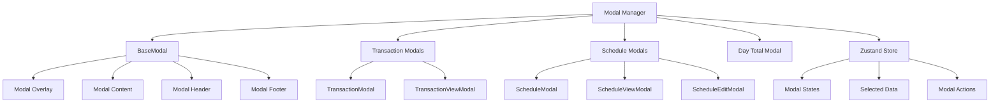
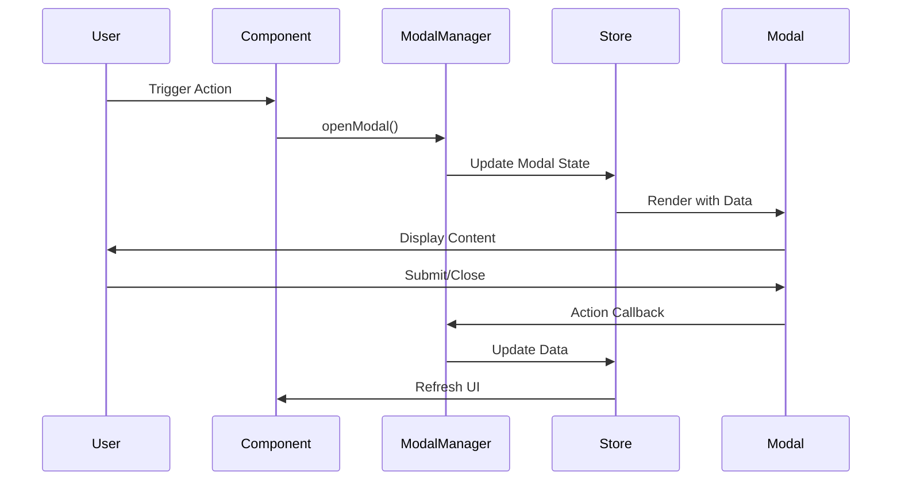

# モーダルコンポーネントシステム

## 🪟 概要

モーダルコンポーネントシステムは、アプリケーション全体で一貫性のあるモーダルダイアログを提供します。Zustand状態管理と連携し、複雑なモーダル間遷移とデータ管理を効率的に行います。

## 🏗️ システム構成

### アーキテクチャ図



### データフロー



## 📦 コンポーネント一覧

| コンポーネント | 説明 | 主な用途 |
|----------------|------|----------|
| `BaseModal` | ベースモーダル | 全モーダルの基盤 |
| `TransactionModal` | 取引入力/編集 | 新規取引作成、既存取引編集 |
| `TransactionViewModal` | 取引一覧表示 | 日別取引一覧、詳細表示 |
| `ScheduleModal` | スケジュール表示 | 引落予定表示 |
| `ScheduleViewModal` | スケジュール一覧 | 日別スケジュール一覧 |
| `ScheduleEditModal` | スケジュール編集 | 引落予定編集 |
| `DayTotalModal` | 日別合計表示 | 日別統計と詳細 |

## 🎯 BaseModal

### インターフェース

```typescript
interface BaseModalProps {
  isOpen: boolean;
  onClose: () => void;
  title?: string;
  description?: string;
  size?: 'sm' | 'md' | 'lg' | 'xl' | 'full';
  closeOnOverlayClick?: boolean;
  closeOnEscape?: boolean;
  showCloseButton?: boolean;
  children: React.ReactNode;
  footer?: React.ReactNode;
  className?: string;
  contentClassName?: string;
}

interface BaseModalFooterProps {
  children: React.ReactNode;
  className?: string;
}
```

### 実装例

```typescript
import { BaseModal } from '@/components/calendar';

export function CustomModal({ isOpen, onClose, data }: CustomModalProps) {
  return (
    <BaseModal
      isOpen={isOpen}
      onClose={onClose}
      title="カスタムモーダル"
      description="カスタムモーダルの説明"
      size="md"
      footer={
        <BaseModalFooter>
          <div className="flex space-x-3">
            <Button variant="outline" onClick={onClose}>
              キャンセル
            </Button>
            <Button variant="primary" onClick={handleSubmit}>
              保存
            </Button>
          </div>
        </BaseModalFooter>
      }
    >
      <div className="space-y-4">
        {/* モーダルコンテンツ */}
      </div>
    </BaseModal>
  );
}
```

### 機能

#### フォーカス管理
- モーダル開時に最初のフォーカス可能要素にフォーカス
- タブキーによるフォーカストラップ
- モーダル閉時に元の要素にフォーカス復帰

#### キーボードナビゲーション
- `Escape`: モーダルを閉じる
- `Tab`/`Shift+Tab`: 要素間フォーカス移動

#### アクセシビリティ
- `role="dialog"` と `aria-modal="true"`
- 適切なARIA属性の設定
- スクリーンリーダー対応

## 💰 TransactionModal

### インターフェース

```typescript
interface TransactionModalProps {
  isOpen: boolean;
  onClose: () => void;
  transaction?: Transaction;
  date?: Date;
  onSave: (transaction: TransactionInput) => Promise<void>;
  onDelete?: (transactionId: string) => Promise<void>;
  banks: Bank[];
  cards: Card[];
  isLoading?: boolean;
}

interface TransactionInput {
  date: string;
  storeName?: string;
  usage?: string;
  amount: number;
  paymentType: 'card' | 'bank';
  cardId?: string;
  bankId?: string;
  scheduledPayDate?: string;
}
```

### 使用例

```typescript
import { TransactionModal } from '@/components/calendar';
import { useModalStore, useTransactionStore } from '@/store';

function CalendarWithTransaction() {
  const { modalStates, selectedData, actions } = useModalStore();
  const { banks, cards, addTransaction, updateTransaction, deleteTransaction } = useTransactionStore();

  const handleTransactionSave = async (transactionData: TransactionInput) => {
    try {
      if (selectedData.transaction) {
        await updateTransaction(selectedData.transaction.id, transactionData);
      } else {
        await addTransaction(transactionData);
      }
      actions.closeModal('transaction');
    } catch (error) {
      console.error('取引保存に失敗:', error);
    }
  };

  const handleTransactionDelete = async (transactionId: string) => {
    try {
      await deleteTransaction(transactionId);
      actions.closeModal('transaction');
    } catch (error) {
      console.error('取引削除に失敗:', error);
    }
  };

  return (
    <>
      {/* カレンダーコンポーネント */}
      
      <TransactionModal
        isOpen={modalStates.transaction}
        onClose={() => actions.closeModal('transaction')}
        transaction={selectedData.transaction}
        date={selectedData.date}
        onSave={handleTransactionSave}
        onDelete={handleTransactionDelete}
        banks={banks}
        cards={cards}
      />
    </>
  );
}
```

### 機能

#### フォーム機能
- 取引日、店舗名、用途、金額の入力
- 支払い方法（カード/銀行）の選択
- カード選択時の自動引落日計算
- リアルタイムバリデーション

#### 支払い計算
```typescript
// カード支払いの引落日計算
const calculatePaymentDate = (
  transactionDate: Date,
  card: Card
): Date => {
  const closingDay = card.closingDay;
  const paymentDay = card.paymentDay;
  const monthShift = card.monthShift;

  // 締日の判定
  const isAfterClosing = transactionDate.getDate() > closingDay;
  
  // 支払い月の計算
  const paymentMonth = new Date(transactionDate);
  paymentMonth.setMonth(
    paymentMonth.getMonth() + monthShift + (isAfterClosing ? 1 : 0)
  );
  
  // 引落日の設定
  paymentMonth.setDate(paymentDay);
  
  // 営業日調整
  return adjustToBusinessDay(paymentMonth);
};
```

## 👁️ TransactionViewModal

### インターフェース

```typescript
interface TransactionViewModalProps {
  isOpen: boolean;
  onClose: () => void;
  date: Date;
  transactions: Transaction[];
  onTransactionClick: (transaction: Transaction) => void;
  onEditClick: (transaction: Transaction) => void;
  onDeleteClick: (transactionId: string) => Promise<void>;
}
```

### 機能

#### 取引一覧表示
- 選択日の全取引を時系列表示
- 取引種別（カード/銀行）別の分類
- 合計金額の計算と表示

#### インタラクション
- 個別取引の編集モーダルへの遷移
- 取引の削除（確認ダイアログ付き）
- 新規取引追加へのショートカット

### 使用例

```typescript
<TransactionViewModal
  isOpen={modalStates.transactionView}
  onClose={() => actions.closeModal('transactionView')}
  date={selectedData.date}
  transactions={selectedData.transactions}
  onTransactionClick={(transaction) => {
    actions.closeModal('transactionView');
    actions.openModal('transaction', { transaction, date: selectedData.date });
  }}
  onEditClick={(transaction) => {
    actions.closeModal('transactionView');
    actions.openModal('transaction', { transaction });
  }}
  onDeleteClick={handleTransactionDelete}
/>
```

## 📅 ScheduleViewModal

### インターフェース

```typescript
interface ScheduleViewModalProps {
  isOpen: boolean;
  onClose: () => void;
  date: Date;
  scheduleItems: ScheduleItem[];
  onScheduleClick: (scheduleItem: ScheduleItem) => void;
  onTransactionClick: (transactionId: string) => Promise<void>;
}
```

### 機能

#### スケジュール表示
- 選択日の引落予定一覧
- 銀行別、カード別のグループ表示
- 関連取引への参照リンク

#### クロス参照
- スケジュールから関連取引への遷移
- 取引データとの整合性チェック

## 📊 DayTotalModal

### インターフェース

```typescript
interface DayTotalModalProps {
  isOpen: boolean;
  onClose: () => void;
  date: Date;
  dayTotalData: DayTotalData;
  onTransactionViewClick: () => void;
  onScheduleViewClick: () => void;
  onAddTransactionClick: () => void;
}

interface DayTotalData {
  date: string;
  totalAmount: number;
  transactionTotal: number;
  scheduleTotal: number;
  cardTotal: number;
  directTotal: number;
  transactionCount: number;
  scheduleCount: number;
  transactions: Transaction[];
  scheduleItems: ScheduleItem[];
  hasData: boolean;
  hasTransactions: boolean;
  hasSchedule: boolean;
}
```

### 機能

#### 統計表示
- 日別の総合計金額
- 取引/スケジュール別の内訳
- カード/銀行支払い別の分類

#### ナビゲーション
- 詳細な取引一覧への遷移
- スケジュール詳細への遷移
- 新規取引追加のショートカット

## 🔄 Modal Manager

### useModalManager フック

```typescript
interface UseModalManagerReturn {
  // Modal states
  modalStates: ModalStates;
  selectedData: SelectedData;
  
  // Modal control handlers
  openTransactionModal: (date: Date, transaction?: Transaction) => void;
  openTransactionViewModal: (date: Date, transactions: Transaction[]) => void;
  openScheduleViewModal: (date: Date, scheduleItems: ScheduleItem[]) => void;
  openScheduleEditModal: (scheduleItem: ScheduleItem) => void;
  openDayTotalModal: (date: Date, dayTotalData: DayTotalData) => void;
  
  // Close handlers
  closeTransactionModal: () => void;
  closeTransactionViewModal: () => void;
  closeScheduleViewModal: () => void;
  closeScheduleEditModal: () => void;
  closeDayTotalModal: () => void;
  closeAllModals: () => void;
  
  // Cross-modal operations
  handleTransactionViewTransactionClick: (transaction: Transaction) => void;
  handleScheduleTransactionClick: (transactionId: string) => Promise<void>;
  
  // Data operation handlers
  handleTransactionSave: (transactionInput: TransactionInput) => Promise<void>;
  handleTransactionDelete: (transactionId: string) => Promise<void>;
  handleScheduleSave: (scheduleId: string, updates: Partial<ScheduleItem>) => Promise<void>;
  handleScheduleDelete: (scheduleId: string) => Promise<void>;
}
```

### 使用例

```typescript
import { useModalManager } from '@/hooks/modal';

function CalendarComponent() {
  const {
    modalStates,
    selectedData,
    openTransactionModal,
    openDayTotalModal,
    closeAllModals,
    handleTransactionSave,
    handleTransactionDelete,
  } = useModalManager({
    onTransactionSave: async (data) => {
      await database.addTransaction(data);
      // 成功後の処理
    },
    onTransactionDelete: async (id) => {
      await database.deleteTransaction(id);
      // 成功後の処理
    },
    banks,
    cards,
  });

  const handleDateClick = (date: Date, dayTotal?: DayTotalData) => {
    if (dayTotal) {
      openDayTotalModal(date, dayTotal);
    } else {
      openTransactionModal(date);
    }
  };

  return (
    <div>
      {/* カレンダーUI */}
      
      {/* 全モーダル */}
      <TransactionModal
        isOpen={modalStates.transaction}
        onClose={() => closeTransactionModal()}
        transaction={selectedData.transaction}
        date={selectedData.date}
        onSave={handleTransactionSave}
        onDelete={handleTransactionDelete}
        banks={banks}
        cards={cards}
      />
      
      <DayTotalModal
        isOpen={modalStates.dayTotal}
        onClose={() => closeDayTotalModal()}
        date={selectedData.date}
        dayTotalData={selectedData.dayTotalData}
        onTransactionViewClick={() => {
          closeDayTotalModal();
          openTransactionViewModal(selectedData.date!, selectedData.dayTotalData!.transactions);
        }}
      />
    </div>
  );
}
```

## 🎨 スタイリング

### デザインシステム

```css
/* モーダル共通スタイル */
.modal-overlay {
  @apply fixed inset-0 bg-black bg-opacity-50 flex items-center justify-center p-4 z-50;
}

.modal-content {
  @apply bg-white rounded-lg shadow-xl max-h-full overflow-hidden;
}

.modal-header {
  @apply px-6 py-4 border-b border-gray-200;
}

.modal-body {
  @apply px-6 py-4 overflow-y-auto;
}

.modal-footer {
  @apply px-6 py-4 border-t border-gray-200 bg-gray-50;
}

/* サイズバリエーション */
.modal-sm { @apply max-w-md; }
.modal-md { @apply max-w-lg; }
.modal-lg { @apply max-w-2xl; }
.modal-xl { @apply max-w-4xl; }
.modal-full { @apply max-w-full mx-4; }
```

### アニメーション

```css
/* エントランスアニメーション */
.modal-enter {
  @apply opacity-0 scale-95;
}

.modal-enter-active {
  @apply opacity-100 scale-100 transition-all duration-200 ease-out;
}

.modal-exit {
  @apply opacity-100 scale-100;
}

.modal-exit-active {
  @apply opacity-0 scale-95 transition-all duration-150 ease-in;
}
```

## 🧪 テスト戦略

### モーダルテストの例

```typescript
import { render, screen, fireEvent, waitFor } from '@testing-library/react';
import { TransactionModal } from '@/components/calendar';

describe('TransactionModal', () => {
  const mockBanks = [
    { id: '1', name: 'SBI銀行', createdAt: Date.now() }
  ];
  
  const mockCards = [
    { 
      id: '1', 
      name: 'メインカード', 
      bankId: '1', 
      closingDay: 15, 
      paymentDay: 10,
      monthShift: 1 
    }
  ];

  it('新規取引モーダルが正しく表示される', () => {
    render(
      <TransactionModal
        isOpen={true}
        onClose={jest.fn()}
        date={new Date('2025-08-17')}
        onSave={jest.fn()}
        banks={mockBanks}
        cards={mockCards}
      />
    );

    expect(screen.getByText('取引を追加')).toBeInTheDocument();
    expect(screen.getByDisplayValue('2025-08-17')).toBeInTheDocument();
  });

  it('取引データがフォームに正しく反映される', () => {
    const mockTransaction = {
      id: '1',
      date: '2025-08-17',
      storeName: 'テストストア',
      usage: 'テスト用途',
      amount: 1000,
      paymentType: 'card' as const,
      cardId: '1',
    };

    render(
      <TransactionModal
        isOpen={true}
        onClose={jest.fn()}
        transaction={mockTransaction}
        onSave={jest.fn()}
        banks={mockBanks}
        cards={mockCards}
      />
    );

    expect(screen.getByDisplayValue('テストストア')).toBeInTheDocument();
    expect(screen.getByDisplayValue('1000')).toBeInTheDocument();
  });

  it('保存ボタンクリックで正しいデータが送信される', async () => {
    const mockOnSave = jest.fn();
    
    render(
      <TransactionModal
        isOpen={true}
        onClose={jest.fn()}
        date={new Date('2025-08-17')}
        onSave={mockOnSave}
        banks={mockBanks}
        cards={mockCards}
      />
    );

    // フォーム入力
    fireEvent.change(screen.getByLabelText('店舗名'), {
      target: { value: 'テストストア' }
    });
    fireEvent.change(screen.getByLabelText('金額'), {
      target: { value: '1500' }
    });

    // 保存ボタンクリック
    fireEvent.click(screen.getByText('保存'));

    await waitFor(() => {
      expect(mockOnSave).toHaveBeenCalledWith({
        date: '2025-08-17',
        storeName: 'テストストア',
        amount: 1500,
        paymentType: 'card',
        // その他のデフォルト値
      });
    });
  });

  it('Escキーでモーダルが閉じる', () => {
    const mockOnClose = jest.fn();
    
    render(
      <TransactionModal
        isOpen={true}
        onClose={mockOnClose}
        date={new Date()}
        onSave={jest.fn()}
        banks={mockBanks}
        cards={mockCards}
      />
    );

    fireEvent.keyDown(document, { key: 'Escape' });
    expect(mockOnClose).toHaveBeenCalled();
  });
});
```

## ♿ アクセシビリティ

### ARIA属性

```typescript
// モーダルダイアログのARIA属性
<div
  role="dialog"
  aria-modal="true"
  aria-labelledby="modal-title"
  aria-describedby="modal-description"
>
  <h2 id="modal-title">{title}</h2>
  <p id="modal-description">{description}</p>
  {children}
</div>
```

### キーボードサポート

- **Tab/Shift+Tab**: フォーカス移動
- **Enter**: フォーム送信/ボタン実行
- **Escape**: モーダル閉じる
- **Space**: チェックボックス/ボタン操作

### スクリーンリーダー対応

- 適切な見出し構造
- フォームラベルとの関連付け
- エラーメッセージの読み上げ
- ローディング状態の通知

## 📚 関連ドキュメント

- [Modal Manager Hook](../../hooks/modal.md)
- [状態管理アーキテクチャ](../../architecture/state-management.md)
- [アクセシビリティガイド](../../accessibility.md)
- [テスト戦略](../../guides/testing.md)

